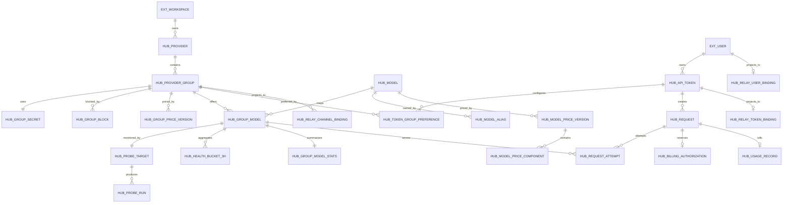

# LLMHub 二期数据模型

本文定义 LLMHub 二期的逻辑数据模型、数据库归属、New API 映射和实施顺序。
二期仍处于内测重写阶段，不要求兼容一期表结构或历史数据。

## 1. 表归属标记

文档使用以下标记，所有迁移、代码和评审都应保留这个边界：

| 标记 | 所有者 | 是否为业务事实源 | 说明 |
| --- | --- | --- | --- |
| `[LH]` | LLMHub | 是 | 服务商、分组、模型目录、价格、探测、订阅、用量和结算 |
| `[NA]` | New API 官方 | 否 | 原生转发引擎表，由 LLMHub 配置同步生成，可重建 |
| `[NA-X]` | X-LLM 定制 New API | 否 | 确有必要时新增的扩展代码或 `xllm_` 前缀表 |
| `[EXT]` | 外部身份系统 | 是 | 现有用户和工作区身份，二期首批表只引用其稳定 ID |

### 命名规则

- LLMHub 新表统一使用 `hub_` 前缀。
- New API 官方表保留官方名称，不复制到 LLMHub 数据库。
- New API 定制表必须使用 `xllm_` 前缀。
- 不直接给 New API 官方表增加 LLMHub 业务字段。
- LLMHub 表中不把 New API 的整数 ID 当业务主键，只通过绑定表保存映射。

## 2. 核心业务决定

1. **分组是最小供给单元。** 一个分组同时代表真实销售、真实流量、真实探测和真实计费能力。
2. **一个分组只有一套当前有效的 Base URL 和 API Key。** 密钥内部独立加密保存，但产品界面不提供第二套“密钥管理”概念。
3. **模型价格由平台维护。** 服务商只设置统一分组倍率，不逐个模型填价格。
4. **分组模型来自真实接口发现。** `/v1/models` 返回的上游模型名通过 `hub_group_models` 关联到平台模型目录。
5. **排行榜的最小统计单位是“分组 + 模型”。** 榜单必须先按标准模型、时间窗口和规则版本分区，再展示服务商与分组；不同模型不能混排。
6. **探测和用户请求必须使用同一分组凭证。** 不能使用一把稳定密钥做探测，再用另一把低质量密钥承接用户请求。
7. **LLMHub 是事实源，New API 是执行引擎。** New API 中的渠道、内部令牌和倍率均为运行时投影；`logs` 只用于诊断，不能作为账务事件源。

## 3. 数据库边界

```text
LLMHub Core
├─ [EXT] 身份：用户、工作区
├─ [LH] 服务商与分组
├─ [LH] 模型目录与价格
├─ [LH] 探测与健康度
├─ [LH] 用户令牌与订阅偏好
├─ [LH] 用量、账本与结算
└─ [LH] 转发引擎绑定

New API Runtime
├─ [NA] users
├─ [NA] tokens
├─ [NA] channels
├─ [NA] abilities
├─ [NA] options
├─ [NA] logs
└─ [NA-X] xllm_* 扩展（仅在无法通过适配层解决时）
```

`LLMHub Core` 使用 PostgreSQL 作为二期事务事实库。原始探测首版按月分区保留在 PostgreSQL；
以后迁移到 ClickHouse 或 Tinybird 时只保持稳定 ID 和逻辑引用，强一致的账务事实仍留在 PostgreSQL。

New API 使用独立数据库。严禁两个服务直接写对方的业务表。

## 4. 核心 ER 关系



## 5. LLMHub 自有表

### 5.1 第一批：服务商、分组和模型

#### `[LH] hub_providers`

服务商的公开身份和归属，不保存具体调用配置。

关键字段：

| 字段 | 说明 |
| --- | --- |
| `id` | LLMHub 稳定主键 |
| `owner_workspace_id` | `[EXT]` 工作区 ID；平台托管时允许为空 |
| `management_mode` | `platform_managed` / `provider_managed` |
| `slug` | 公开地址稳定标识 |
| `name` / `display_name` | 服务商名称 |
| `description` / `website_url` / `logo_asset_id` | 公开资料 |
| `claimable` | 平台托管服务商是否允许认领 |
| `status` | `draft` / `active` / `suspended` / `retired` |
| `created_at` / `updated_at` | 审计时间 |

关系：一个服务商拥有多个 `hub_provider_groups`。

#### `[LH] hub_provider_groups`

二期最核心的业务表。一个分组就是一套可以被探测、上架、路由和结算的供给能力。

关键字段：

| 字段 | 说明 |
| --- | --- |
| `id` | 分组主键 |
| `provider_id` | 所属服务商 |
| `name` / `description` | 分组名称和说明 |
| `base_url_ciphertext` | 默认 Base URL，加密保存 |
| `base_url_host_hash` | 去重和审计使用，不可反解 |
| `lifecycle_status` | `draft` / `verifying` / `ready` / `retired` |
| `desired_status` | 人工期望状态：`active` / `paused` / `retired` |
| `listing_status` | `private` / `pending` / `listed` / `delisted` |
| `config_version` | Base URL、密钥或模型配置变化时递增 |
| `last_balance_micros` / `balance_currency` | 最近一次上游余额快照和币种 |
| `balance_status` / `balance_checked_at` / `balance_stale_at` | 余额查询状态和时效 |
| `created_at` / `updated_at` | 审计时间 |

约束：

- `retired` 分组不能重新进入路由，只能复制创建新分组。
- `lifecycle_status`、`desired_status`、`listing_status`、阻断原因和健康状态必须分开。
- 服务商被暂停时，其所有分组都退出新流量，但历史数据保留。

#### `[LH] hub_group_blocks`

一个分组可以同时存在多条活动阻断，例如人工暂停、余额不足和鉴权失败。每条记录保存
`source`、`reason_code`、`stops_traffic`、`stops_probes`、`auto_clear`、`created_at` 和
`resolved_at`。只有 `desired_status = active` 且不存在停止流量的活动阻断时，分组才能承接新请求。

活动阻断使用 `(group_id, source, reason_code) WHERE resolved_at IS NULL` 唯一约束。自动恢复只能
解除自己创建的阻断，不能覆盖人工暂停或平台风控。

#### `[LH] hub_group_secrets`

分组当前有效密钥的安全存储。它是内部 1:1 表，不是独立产品对象。

关键字段：

| 字段 | 说明 |
| --- | --- |
| `group_id` | 主键，同时外键指向 `hub_provider_groups.id` |
| `api_key_ciphertext` | 加密后的 API Key |
| `key_fingerprint` | 去重、审计和探测归属哈希 |
| `last_four` | 界面安全展示 |
| `secret_version` | 每次轮换递增，用于同步幂等 |
| `rotated_at` | 最近轮换时间 |
| `updated_at` | 更新时间 |

密钥轮换覆盖当前密钥，不保留可解密的旧密钥。轮换必须与分组 `config_version` 递增及同步
outbox 写入处于同一事务；历史审计只保存当时的指纹和版本，旧同步任务不能覆盖新版本。

#### `[LH] hub_models`

平台维护的标准模型目录，不由服务商自行定价。

关键字段：

| 字段 | 说明 |
| --- | --- |
| `id` / `slug` | 稳定模型标识 |
| `vendor` / `family` | 厂商和系列 |
| `canonical_name` | API 标准模型名 |
| `display_name` / `short_name` | 展示名称 |
| `capabilities` | 文本、图像、音频、缓存等能力 |
| `status` | `active` / `deprecated` / `retired` |
| `sort_order` | 平台展示顺序 |

一条模型目录记录不会自动出现在榜单。只有已上架分组的有效 `hub_group_models` 才能展示。

#### `[LH] hub_model_aliases`

标准模型别名的规范化表，保存 `model_id`、`namespace`、`alias` 和 `normalized_alias`。
`(namespace, normalized_alias)` 必须唯一，避免数组别名无法约束而产生自动映射歧义。

#### `[LH] hub_model_price_versions`

官方价格的版本表。价格变化新增版本，不覆盖历史价格。

关键字段：

| 字段 | 说明 |
| --- | --- |
| `id` | 价格版本主键 |
| `model_id` | 对应平台模型 |
| `currency` | 首版建议统一为 USD 计价基准 |
| `billing_mode` | `token` / `per_request` / `component` / `tiered` |
| `effective_from` / `effective_to` | 生效区间 |
| `source` / `source_version` | 官方同步来源和版本 |

同一模型和币种的价格版本使用半开区间 `[effective_from, effective_to)`，由 PostgreSQL exclusion
constraint 保证区间不重叠，并保证最多一个无结束时间的当前版本。Stage A 迁移会启用受信任扩展
`btree_gist`，模型价格和分组倍率都使用该数据库级约束；部署账号需要具备在目标数据库创建扩展的权限。

#### `[LH] hub_model_price_components`

价格版本下的可计费组成，保存 `component`、`unit`、`unit_size`、`amount_micros` 和可选
`tier_key`。文本输入、文本输出、缓存读写、音频、图像和按次计费使用同一结构表达；首版价格
编译器只发布已明确支持的组件，未映射完成的模型不得开放流量。

#### `[LH] hub_group_price_versions`

分组倍率的版本表，保存 `group_id`、`multiplier_bps`、半开生效区间、操作者和变更原因。
`10000` 表示 `1.0000x`。请求进入系统时锁定模型价格版本和分组倍率版本，历史账单同时保存
版本 ID 与数值快照。

#### `[LH] hub_group_models`

分组与平台模型的关联，也是排行榜和路由的最小能力单元。

关键字段：

| 字段 | 说明 |
| --- | --- |
| `id` | 关联主键 |
| `group_id` / `model_id` | 分组和平台模型；未完成映射时 `model_id` 可为空 |
| `upstream_model_name` | `/v1/models` 返回的真实名称 |
| `normalized_upstream_name` | 分组内去重后的上游名称 |
| `base_url_override_ciphertext` | 少数模型专用 Base URL，可为空 |
| `discovery_status` | `unmapped` / `active` / `missing` / `retired` |
| `traffic_enabled` | 是否允许承接用户请求 |
| `probe_enabled` | 是否参与持续探测 |
| `first_seen_at` / `last_seen_at` | 模型发现时间 |
| `missing_count` / `retired_at` | 自动退役与恢复所需状态 |

唯一约束为 `(group_id, normalized_upstream_name)`。一个标准模型可以映射多个真实上游名称；
`model_id IS NULL` 时必须保持 `traffic_enabled = false` 且 `probe_enabled = false`，完成标准模型映射
和价格确认后才能进入探测与流量。

### 5.2 第二批：探测和健康度

#### `[LH] hub_probe_targets`

与 `hub_group_models` 1:1，保存调度和协议配置，不重复保存密钥。

主要字段：`group_model_id`、`endpoint_type`、`interval_seconds`、`timeout_ms`、
`next_check_at`、`lease_token`、`locked_by`、`locked_until`、`enabled`、`model_not_found_count`。

探测执行时必须通过 `group_model -> group -> group_secret` 获取与用户流量相同的凭证。

#### `[LH] hub_probe_runs`

不可变的单次探测事实。一次计划探测使用稳定的 `probe_cycle_id`，每次执行保存 `attempt_no`、
结果分类、HTTP 状态、首字时间、总耗时、Token 数、请求 ID、分组密钥指纹版本等。

`(target_id, probe_cycle_id, attempt_no)` 必须唯一。worker 领取任务使用数据库租约和 CAS，重试记录
使用 `attempt_no > 0`，不能重复改变一次计划探测的可用率分母。

#### `[LH] hub_health_buckets_3h`

按 `group_model_id + bucket_start` 聚合三小时桶，保存成功数、服务商失败数、配置错误数、
观察器错误数、可用率和数据覆盖率。

#### `[LH] hub_group_model_stats`

每个 `hub_group_models` 一条当前汇总，保存 7 日稳定性、首字 P50/P95、样本数、排名分、
健康状态和最近成功/失败时间。它是可重建结果，不是原始事实。

分组卡片健康状态由其可路由模型的汇总结果计算，不允许通过表单直接修改。

### 5.3 第三批：用户令牌和订阅路由

#### `[LH] hub_api_tokens`

用户在 LLMHub 创建的调用令牌。保存 `[EXT] owner_user_id`、令牌哈希、名称、状态和
过期时间。首版余额通过账本关联计算，不把额度或模型限制塞进令牌表。明文令牌只在创建时返回一次，并由 LLMHub 网关完成鉴权；New API 只接收
可轮换的内部令牌，因此运行库丢失后不需要恢复用户明文令牌。

#### `[LH] hub_token_group_preferences`

用户令牌与分组之间的订阅和优先级关系。

关键字段：`token_id`、`group_id`、`priority`、`weight`、`enabled`。首版不增加令牌级倍率上限和模型白名单。

路由顺序：

1. 当前令牌明确订阅且健康的分组；
2. 用户允许的其他公开分组；
3. 平台兜底池；
4. 没有满足价格、模型和健康条件的分组时返回明确错误。

这张表是 LLMHub 特有能力，不能直接用 New API 的全局 `Group` 字符串替代。

### 5.4 第四批：用量和结算

#### `[LH] hub_requests`

一次用户调用的稳定事实，保存 LLMHub 请求 ID、用户令牌、标准模型、锁定的价格与路由策略版本、
状态和最终结果。

#### `[LH] hub_request_attempts`

每次真实上游尝试一条记录，保存顺序、`group_model_id`、渠道绑定版本、上游请求 ID、结果、
实际用量和可计费上游成本。跨组重试不能只保存布尔值。

#### `[LH] hub_usage_records`

每次最终计费用量的不可变事实，至少保存：

- LLMHub 请求 ID 和 New API 请求 ID；
- `request_id`、最终 `group_model_id` 和 `model_price_version_id`；
- 输入、输出、缓存和其他计费单位；
- 当时模型价格版本及各类单位价格快照；
- 当时分组倍率、平台费率和汇率快照；
- 用户实付、服务商应收和平台收入；
- 请求结果、尝试次数和最终渠道绑定版本。

官方价格、分组倍率或平台费率变化后，历史记录不得重算。

#### `[LH] hub_ledger_accounts`、`hub_ledger_journals`、`hub_ledger_lines`

真实付费开放前使用严格复式账本。充值、冻结、结算、退款、服务商应收和平台收入都写入凭证；
同币种借贷必须平衡，已过账凭证不可修改，只能冲销。余额是账本聚合结果。

预扣使用独立的 `hub_billing_authorizations` 状态机表达 `reserved`、`captured`、`released` 和
`expired`。余额检查与冻结处于同一事务；成功后按实际用量结算并退还差额，失败主动释放，进程异常
遗留且已明确失败的冻结由维护循环按过期时间回收。上游成功后，网关先持久化结算快照和 success
attempt；即时捕获失败时由维护循环自动重试。`request_id` 唯一，重复授权、结算和释放必须保持幂等。

### 5.5 转发引擎绑定

#### `[LH] hub_relay_channel_bindings`

`hub_provider_groups` 到 New API `channels` 的 1:N 投影映射。默认 Base URL 生成一个运行时渠道；
每个不同的模型级 Base URL 覆盖生成额外隐藏渠道，产品侧仍只展示一个分组。

字段包括：`group_id`、`group_model_id`、`engine`、`engine_instance`、`endpoint_slot`、
`external_channel_id`、`desired_version`、`applied_version`、`desired_checksum`、`sync_status`、
`attempt_count`、`next_retry_at`、`lease_until`、`valid_from`、`valid_to` 和错误信息。旧绑定只失效不删除。

#### `[LH] hub_relay_user_bindings`

`[EXT]` 用户到 New API `users` 的 1:1 投影映射。保存 `owner_user_id`、`engine`、
`external_user_id` 和同步版本，不在 New API `users` 中添加 LLMHub 用户字段。

#### `[LH] hub_relay_token_bindings`

`hub_api_tokens` 到 New API `tokens` 的 1:1 投影映射，字段结构与渠道绑定类似。

绑定表删除或失效不会删除 LLMHub 业务对象。重新同步可以创建新的 New API ID。

## 6. New API 原生表及映射

下表只描述集成使用方式，不表示这些表属于 LLMHub。

| 表 | 归属 | LLMHub 映射 | 首版是否修改原生结构 |
| --- | --- | --- | --- |
| `channels` | `[NA]` | 一个分组按 Base URL 分区投影为一个或多个渠道 | 否 |
| `abilities` | `[NA]` | `hub_group_models` 同步后由渠道能力生成 | 否 |
| `users` | `[NA]` | LLMHub 用户的运行时计费账户投影 | 否 |
| `tokens` | `[NA]` | LLMHub 网关使用的内部可轮换令牌 | 否 |
| `options` | `[NA]` | 同步模型倍率、分组倍率和 auto group 配置 | 否 |
| `logs` | `[NA]` | 转发诊断日志，不参与账务事件投递 | 否 |
| `xllm_usage_outbox` | `[NA-X]` | 与最终 quota 变更同事务写入的可靠计量事件 | 新增表 |

### 6.1 `channels` 映射

| New API 字段 | LLMHub 来源 |
| --- | --- |
| `Name` | 服务商名 + 分组名 + LLMHub 分组 ID |
| `BaseURL` | `hub_provider_groups.base_url_ciphertext` 解密值 |
| `Key` | `hub_group_secrets.api_key_ciphertext` 解密值 |
| `Models` | LLMHub 对外开放的 `hub_models.canonical_name` |
| `ModelMapping` | `canonical_name -> upstream_model_name` |
| `Group` | 适配器生成的运行时组名，例如 `lhg_<group_id>` |
| `Status` | 分组运行状态、余额状态和健康策略共同决定 |
| `Priority` / `Weight` | LLMHub 生成的路由快照 |
| `Balance` | New API 查询结果，回传为 LLMHub 最近余额快照 |

New API 的 `Group` 是运行时可用组，不等同于 LLMHub 的服务商分组业务对象，不能反向作为事实源。
New API `channels.Key` 会保存可用的上游明文密钥，因此 New API 数据库、备份和管理接口都属于敏感
凭证边界，必须限制访问、加密备份并确保日志脱敏。

### 6.2 `abilities` 映射

New API 原生 `abilities` 使用 `(group, model, channel_id)` 表达某个运行时组下可用的模型渠道，
并带有 `priority` 和 `weight`。它适合执行已经计算好的路由结果，不适合保存用户订阅关系。

### 6.3 `options` 价格映射

New API 目前通过 `options` 中的配置保存模型倍率、分组倍率、auto group 和特殊分组倍率。
LLMHub 通过单一价格编译器生成完整配置版本，分组同步任务不得分别覆盖全局 JSON：

```text
模型官方价格组件 -> 明确换算后的 ModelPrice / ModelRatio / CompletionRatio / CacheRatio
分组 multiplier_bps -> New API 实际使用组 GroupRatio
```

New API 的 `ModelPrice` 与 `ModelRatio` 语义不同，发布前必须用相同用量做两边金额一致性测试，
不能直接复制官方价格数字。New API 以实际 `UsingGroup` 计算运行时 quota；LLMHub 账本是唯一财务
事实源，New API quota 只是实时准入镜像。

### 6.4 用户订阅路由的能力缺口

New API 官方支持：

- 全局 auto group 顺序；
- 分组内渠道优先级和权重；
- 跨组失败重试；
- 用户组对运行时组的特殊倍率和可用范围。

但它没有原生的“每个 LLMHub 用户令牌各自订阅任意分组并拥有独立优先级”关系。
首版验证只使用平台统一路由池，不修改 New API 表。进入用户订阅阶段时按以下顺序处理：

1. Redis 只保存每个令牌的少量订阅偏好、每个模型的全局健康候选和全局禁用集合；
2. New API 增加 `[NA-X]` 路由接口，为每次请求生成 3 至 10 个有序候选渠道；
3. 每次重试都从同一个版本化路由计划取下一候选，并记录最终 `UsingGroup`；
4. 不把上万个 LLMHub 分组复制成 New API 全局 auto group 顺序，也不使用 `GroupGroupRatio` 保存令牌级策略；
5. Redis 只做可重建缓存，探测、同步和账务事件不能以 Redis 为唯一事实源。

该阶段预期是 `[NA-X]` 代码扩展，不修改 `[NA] channels`、`abilities` 或 `tokens` 表结构。

## 7. New API 定制变更登记

### 7.1 当前已存在的 X-LLM 数据模型相关定制

当前 X-LLM New API 分支存在：

| 对象 | 归属 | 类型 | 说明 |
| --- | --- | --- | --- |
| `xllm_group_stability_samples` | `[NA-X]` | 新增表 | 保存 New API 渠道测试形成的分组稳定性样本 |
| `xllm_channel_bindings` | `[NA-X]` | 新增表 | 保存 LLMHub `source_ref` 到 New API 原生渠道 ID 的版本化、可重建绑定 |
| `ChannelInfo.Scan` | `[NA-X]` | 代码修改 | 增强空值和字符串类型兼容，不增加官方表字段 |

本清单只登记与二期数据模型直接相关的定制，不是 X-LLM 分支的完整功能差异清单。当前核对范围内，
X-LLM 没有为 LLMHub 修改 New API 原生 `channels`、`abilities`、`tokens`、
`users` 或 `logs` 表结构。`xllm_channel_bindings` 只保存可重建投影和版本栅栏；
`xllm_group_stability_samples` 是现有 X-LLM 功能，二期排行榜不依赖它；
二期探测事实仍写入 `[LH] hub_probe_runs`。

此结论属于设计时快照。每次合并 New API 上游或开始二期适配前，都要重新执行 schema diff。

### 7.2 后续修改规则

任何 New API 定制必须在本节登记：

| 变更级别 | 规则 |
| --- | --- |
| 原生代码扩展 | 放在独立接口或 `xllm_` 文件中，避免散落修改 |
| 新增数据表 | 必须使用 `xllm_` 前缀，并注明能否重建 |
| 修改原生字段 | 默认禁止；确有必要时需要独立 ADR、迁移和回滚方案 |
| 删除或重命名官方字段 | 禁止 |

## 8. 状态模型

分组展示状态不能再由单个字段承担全部含义。

### 8.1 生命周期和人工期望状态

```text
draft -> verifying -> ready -> retired

desired_status: active <-> paused -> retired
```

- `draft`：资料未完整，不探测、不路由。
- `verifying`：正在获取模型并积累首轮探测，不承接公开流量。
- `ready`：配置已验证；是否承接流量还要结合人工期望、阻断、上架、模型和路由健康。
- `desired_status = paused`：人工暂停；自动任务不能替用户恢复。
- `retired`：永久退出，不自动恢复。

### 8.2 上架状态 `listing_status`

`private`、`pending`、`listed`、`delisted` 只决定公开展示和是否进入公共池，不代表健康状态。

### 8.3 健康状态

公开稳定性与实时路由健康必须分开：

- `probe_health` 仅由平台独立探测计算，用于公开榜单；
- `route_health` 综合短时探测和真实流量错误，用于自动路由，不进入公开稳定性分数。

二者都可以使用 `unknown`、`healthy`、`degraded`、`down`。部分模型异常时，分组卡片应显示
“部分异常”及受影响模型数量，不能直接把整个分组标成“配置错误”或“不可用”。

## 9. 价格与结算公式

用户价格基准：

```text
模型单位售价 = 生效中的官方模型价格 × 分组倍率
用户实付 = 各类实际用量 × 对应模型单位售价
服务商应付 = 各次可结算上游 attempt 按服务商合同分别计算
平台收入 = 用户销售额 - 服务商应付 - 优惠 - 退款 - 支付手续费
```

实际计算必须使用整数最小货币单位或高精度 decimal，禁止使用二进制浮点直接结算。

首版平台费用按用户实付固定为 10%，代码中保留为可替换常量，不写死在表结构中。平台托管分组可能没有外部服务商
应付，不能用“用户实付减平台费”倒推。所有金额必须携带币种；首版若不实现汇率版本，充值、
售价、应付和结算统一使用一种结算币种，不发生隐式换汇。

## 10. 同步和对账

### 10.1 分组同步到 New API

1. LLMHub 在同一事务更新分组/密钥版本并写配置 outbox。
2. 同步器按 Base URL 分区创建或更新一个或多个 New API `channels`。
3. New API 重新生成 `abilities`。
4. 同步器核对 Base URL、密钥指纹、模型、状态和倍率。
5. 使用 checksum 和版本 CAS 更新 `applied_version`；失败按租约与退避重试，旧绑定失效但不删除。

### 10.2 请求用量回流

1. LLMHub 为请求生成全局唯一 `request_id`。
2. New API 为每次尝试记录 `hub_request_attempts` 所需信息，并完成运行时 quota 预扣与结算。
3. `[NA-X] xllm_usage_outbox` 与最终 quota 变化在同一 New API 主库事务写入唯一 `billing_event_id`。
4. 用量消费者按 `(source_system, billing_event_id)` 幂等写入请求、attempt、用量和 LLMHub 账本。
5. 充值、退款和调账先写 LLMHub 账本，再以幂等指令投影 New API quota。
6. 定时对账发现差异时冻结自动结算并告警，不能静默覆盖任一侧数据。

## 11. 一期表处理

以下一期对象不作为二期事实源：

- `radar_pool`、`radar_provider`、`radar_credential`、`radar_probe_target`；
- Marketplace PostgreSQL 中的 `providers`、`provider_models`、`probe_targets`；
- 旧的 `provider + model` 排名主键。

一期版本已经保存在 `archive/llmhub-radar-v1`。二期内测不做兼容迁移，旧表暂时保留到新链路完成验证，
但新代码不得双写新旧业务表。

## 12. 实施顺序

### 阶段 A：分组闭环

创建：

- `[LH] hub_providers`
- `[LH] hub_provider_groups`
- `[LH] hub_group_blocks`
- `[LH] hub_group_secrets`
- `[LH] hub_models`
- `[LH] hub_model_aliases`
- `[LH] hub_model_price_versions`
- `[LH] hub_model_price_components`
- `[LH] hub_group_price_versions`
- `[LH] hub_group_models`

完成新增分组、模型发现、倍率设置、暂停和恢复的真实接口。

### 阶段 B：探测闭环

创建探测目标、探测周期、探测事实、三小时桶和当前汇总。`hub_probe_runs` 从第一天按月分区，
原始记录保留 30 天；首版按“分组 + 模型”维护一条当前 7 日统计快照，快照记录评分规则版本，排行榜再按标准模型展示服务商与分组。历史趋势由 3 小时桶提供，暂不保存多窗口、多评分版本的排行榜快照。

### 阶段 C：New API 适配验证

创建转发绑定和配置 outbox，完成一个分组按 Base URL 投影到多个运行时渠道，验证标准模型映射、
倍率、暂停、余额和失败重试。
本阶段不修改 New API 原生表结构。

### 阶段 D：用户令牌和订阅路由

创建用户令牌、订阅偏好和版本化路由计划，验证“订阅分组优先，失败后公共池兜底”。

### 阶段 E：账本和结算

建立请求 attempt、可靠用量 outbox、价格快照、严格复式账本、充值、预扣、结算、退款和服务商
应付闭环，再开放真实付费流量。

## 13. 第一批迁移前检查

- 确认 `[EXT]` 用户和工作区 ID 在二期中的稳定引用方式。
- 确认倍率允许范围、展示精度、结算币种和最低售价策略。
- 确认平台费用是从用户实付中包含扣除，还是额外加收。
- 确认首版价格编译器支持的计费组件；未支持的模型保持 `unmapped`。
- 确认排行榜在单个模型内公开展示“服务商 + 分组”。

## 14. 2026-08-02 实施状态

### 已完成：阶段 A 分组闭环

- 迁移 `0006_spooky_sentinels.sql` 已建立阶段 A 的 `[LH] hub_*` 表。
- Dashboard 分组列表使用真实管理 API，支持创建、编辑、暂停、恢复和退役。
- 创建或刷新分组时调用上游 `/v1/models`，新发现模型自动进入 `[LH] hub_models`。
- 连续三次目录刷新未发现的模型进入退役状态并停止实际探测；重新发现后按原探测偏好自动恢复。
- 分组详情页为 `/radar/groups/[groupId]`，展示健康概览、模型映射和最近探测记录。
- API Key 只在服务端加密保存和使用；管理响应只返回尾号，不返回明文、密文或指纹。

### 已完成：阶段 B 探测闭环

- 迁移 `0007_previous_pride.sql` 已建立 `[LH] hub_probe_targets`、`hub_probe_cycles`、`hub_probe_runs`、`hub_health_buckets_3h` 和 `hub_group_model_stats`。
- `hub_probe_runs` 按 `scheduled_at` 月度分区，当前迁移包含 2026-08、2026-09 和 default 分区。
- 独立 `marketplace-probe-worker` 以 `FOR UPDATE SKIP LOCKED` 并发领取到期任务；每个模型默认仍按 10 分钟间隔探测。
- 过期租约会复用原探测周期重新领取，旧 worker 的完成请求会因 lease token 不匹配被拒绝。
- worker 使用真实 OpenAI 兼容流式请求，记录首字时间、总延迟、分类结果和脱敏错误摘要。
- 当前配置的首个成功探测会把分组从 `verifying` 切为 `ready`；旧配置结果只保留为证据，不更新当前统计。
- Base URL、密钥或模型映射变化会清除可重建的旧统计和三小时桶；相同模型目录的普通刷新不会清空 7 日数据。
- 余额不足会建立自动余额阻断、停止流量并改为每 6 小时恢复探测；榜单保留历史稳定性并按暂停时长最多扣 10%，成功复检后自动解除阻断。
- 公开 API 已切换到 v2 表，排行榜单位为“标准模型 + 服务商分组”；同一服务商的 Plus、Pro 等分组独立展示和排序。
- 原始探测记录保留 30 天，3 小时聚合保留 13 个月；维护任务同时覆盖一期与二期表，并提前创建当前月及未来三个月的探测分区。

### 已验证

- PostgreSQL 真实迁移和分区挂载。
- 竞争 worker 不会重复领取同一目标。
- 暂停、探测阻断和跨工作区访问隔离。
- worker 崩溃后的租约过期重领，以及旧 lease 完成请求拒绝。
- 旧配置结果不污染当前统计。
- 相同目录刷新保留统计，真实配置变化清除派生统计。
- 欠费暂停不降低稳定性样本，低频复检成功后自动恢复。
- 榜单读取时会把超时未更新的数据即时转为观察中的 stale 状态。
- worker 解密、mock SSE 上游请求、run 落库、统计刷新和 ready 状态切换。
- 首页、模型页和服务商页保留同一服务商的多个分组。
- 管理详情响应不泄露 API Key 明文、密文或指纹。
- 二期分区探测历史和聚合桶可按保留策略清理。

### 已完成：Stage C 前管理闭环

- 服务商在分组探测达到 `ready` 后可以申请上架、撤回申请或主动下架；只有平台管理员可以审核。
- 驳回必须填写说明；已上架分组修改连接、模型映射、倍率或模型级 Base URL 后自动回到待审核并停止流量。
- 分组模型支持可选专用 Base URL；密文和 host hash 同事务更新，相同 host hash 视为无变化。
- 管理员可以维护官方模型的输入、输出和缓存读写价格；价格按 USD / 百万 token 保存版本历史和变更原因。
- 独立目录刷新 worker 启动后立即执行，之后默认每 6 小时覆盖全部未退役分组，默认并发 10；单组失败不会中断整轮。
- Dashboard 已提供分组上架审核和模型价格页面，且入口与 tRPC 写接口都限制为平台管理员。

### 已完成：Stage C 本地适配验证

- 迁移 `0008_fearless_blindfold.sql` 已建立 `hub_config_outbox` 和 `hub_relay_channel_bindings`。
- 配置 outbox 使用 `FOR UPDATE SKIP LOCKED`、租约回收、attempt fencing、版本过期判断和有界指数退避。
- 一个分组按模型实际生效的 Base URL 确定性投影为一个或多个运行时渠道；标准模型名映射到真实上游模型名。
- 渠道使用稳定的 `sourceRef = llmhub:<groupId>:<routeKey>` 和 `lhg_<groupId>` 运行时分组名。
- fake adapter 和本地 PostgreSQL 已验证任务领取、密钥解密、渠道 upsert、移除渠道禁用、绑定落库和任务完成。
- 配置同步 worker 已进入默认 Compose 和发布服务列表；只有四个内部 URL/token 配置完整时才允许生产发布。

### 已完成：Stage C 真实 New API 接入

New API 已增加隔离的 `[NA-X]` 内部扩展，不使用不可靠的通用管理接口：

- 使用 `xllm_channel_bindings` 唯一映射 `source_ref`，不修改原生渠道表；
- 提供按 `source_ref` 幂等 upsert 的内部接口；
- 接口按 `config_version` 拒绝旧配置覆盖新配置；
- 渠道和 abilities 继续由 New API 原生模型维护；
- 返回稳定渠道 ID，并支持相同接口禁用渠道。

内部请求接口只允许访问活动的 LLMHub binding，使用独立鉴权和 SSRF 防护客户端，免除 New API
二次计费但不影响普通请求。canonical model 在 New API 内映射为真实上游模型。本地真实 HTTP 联合
测试已覆盖同步幂等、旧版本栅栏、同版本冲突、禁用/恢复、转发和日志。

### 已完成：Stage D 用户令牌和最小路由闭环

- `0009_small_router_ledger.sql` 已建立用户令牌、订阅偏好、请求、attempt、用量和账本表。
- 用户令牌只保存 SHA-256 hash；完整令牌仅在创建响应中返回一次，支持撤销和过期。
- 管理 API 已提供令牌创建、列表、撤销、余额查询、公开分组列表和订阅偏好替换。
- `/v1/chat/completions` 已实现令牌鉴权、订阅分组优先、公共池兜底、最多 10 个候选、逐次配置复核和失败切换。
- 每次调用保存不可变路由计划；配置版本变化、余额阻断、暂停、下架或绑定失效时会跳过候选并记录 `aborted` attempt。
- Dashboard 已提供最小“令牌与订阅”页面；用户可以调整订阅分组顺序，首版权重固定为 100，
  不提供复杂策略编辑器。

### 已完成：Stage E 最小账本闭环

- 账本使用整数微单位；管理员手工充值使用幂等编号，用户消费按“用户借记、服务商应收贷记、平台收入贷记”入账。
- 首版平台费固定为 10%，价格、分组倍率和用量会保存快照，重复用量事件不会重复扣费。
- `0011_spooky_black_bird.sql` 已增加用量预授权状态机。网关按候选分组最高价格和请求上限冻结预算，
  成功按真实 usage 捕获并退差额，失败释放，维护循环回收过期冻结。
- `0012_chilly_black_tarantula.sql` 增加内部结算快照。上游成功事实与快照同事务落库，即时结算失败
  后 maintenance 会自动续结算，不依赖进程内存或 New API 日志。
- 授权默认保留 30 分钟以覆盖最多 10 个候选的串行超时；已经记录成功 attempt 的授权不会被过期
  回收，避免上游已产生费用后误退款；有结算快照的授权自动重试，没有快照的极端异常才进入人工对账。
- PostgreSQL 行锁保证并发授权不能共同透支；账本余额由凭证聚合计算，不增加可直接修改的余额字段。
- Dashboard 已提供最小“用量与账单”页面，展示账户余额和最近 50 条请求的模型、令牌、最终分组、
  尝试次数、Token 用量与扣费；分页、导出和充值入口仍延后。
- 模型价格必须同时包含文本输入与文本输出组件；存在未定价模型的分组不能通过上架审核，运行时也不会
  将不完整价格视为可计费。
- 当前实现手工充值、预授权、消费结算和失败释放；支付网关、用户退款、服务商提现和自动打款仍延后。

### 明确延后

- `/v1/models` 不能可靠判断 chat、embedding 或 image 端点；首版自动发现模型暂按 `chat_completions` 探测，后续按能力目录拆分。
- 流式响应暂不开放；首版只支持非流式 `/v1/chat/completions`，避免在没有可靠用量事件时提前做流式计费。
- 支付网关、用户退款、服务商提现、自动打款和对账仍延后。
- 完全消除 DNS rebinding 需要把已校验 IP 固定到 HTTP dispatcher；当前实现已阻止私网地址和跨域跳转，但仍保留该残余风险。
